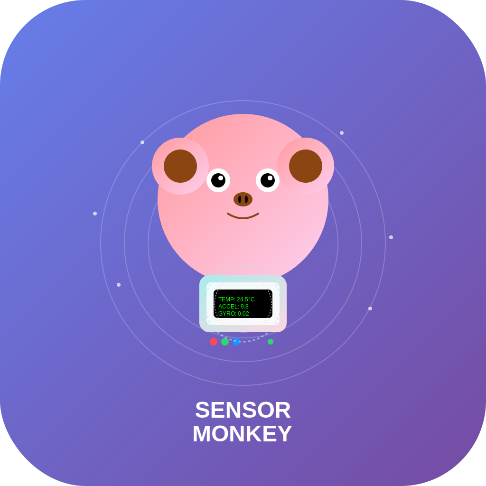

# 🐵 Sensor Monkey

<div align="center">
  
  
  [](https://developer.apple.com/ios/)
  [](https://swift.org/)
  [](https://developer.apple.com/xcode/swiftui/)
  [](LICENSE)
  
  **A comprehensive iOS sensor monitoring application that turns your device into a powerful sensor dashboard**
</div>

## 🎥 Demo

<div align="center">
  
  
  *Real-time sensor monitoring with intuitive controls and beautiful visualizations*
</div>

## ✨ Features

### 🔧 Core Functionality
- **Real-time Sensor Monitoring** - Monitor accelerometer, gyroscope, magnetometer, and more
- **Interactive Dashboard** - Beautiful grid layout with live sensor data
- **Historical Data Visualization** - Charts showing sensor trends over time
- **Customizable Settings** - Fine-tune monitoring intervals and alert thresholds
- **Sensor Calibration** - Built-in calibration tools for accurate readings

### 🎨 User Experience
- **Intuitive Interface** - Clean, modern SwiftUI design
- **Accessibility Support** - Full VoiceOver compatibility and announcements
- **Responsive Layout** - Optimized for all iPhone and iPad sizes
- **Smooth Animations** - Delightful micro-interactions and transitions

### 📊 Data Management
- **Persistent Storage** - Automatic data saving and retrieval
- **Export Capabilities** - Share sensor data for analysis
- **Data Clearing** - Easy management of historical data
- **Settings Backup** - Preserve your custom configurations

## 🚀 Getting Started

### Prerequisites
- iOS 17.0 or later
- Xcode 15.0 or later
- Swift 5.0 or later

### Installation

1. **Clone the repository**
   ```bash
   git clone https://github.com/sitharaj88/ios-sensor-monkey.git
   cd ios-sensor-monkey
   ```

2. **Open in Xcode**
   ```bash
   open "sensor monkey.xcodeproj"
   ```

3. **Build and Run**
   - Select your target device or simulator
   - Press `Cmd + R` to build and run

## 🏗️ Architecture

Sensor Monkey follows a clean architecture pattern with clear separation of concerns:

```
📦 sensor monkey/
├── 🎯 Domain/
│   ├── Models/           # Data models and entities
│   └── Protocols/        # Repository interfaces
├── 📊 Data/
│   ├── Services/         # Core business logic
│   └── Repositories/     # Data access layer
├── 🎨 Presentation/
│   ├── Views/           # SwiftUI views
│   └── ViewModels/      # MVVM view models
├── 🧩 Components/       # Reusable UI components
└── 🔧 Extensions/       # Swift extensions
```

### Key Components

- **SensorService** - Handles Core Motion framework interactions
- **SensorRepository** - Manages sensor data persistence
- **SensorDashboardViewModel** - Orchestrates UI state and sensor monitoring
- **SensorChartView** - Renders beautiful sensor data visualizations

## 📱 Screenshots

### Dashboard View
The main dashboard provides an overview of all active sensors with real-time data updates.

### Settings Panel
Comprehensive settings allow users to customize monitoring parameters, calibration, and alerts.

### Historical Charts
Interactive charts display sensor trends over configurable time periods.

## 🛠️ Available Sensors

| Sensor | Description | Unit | Icon |
|--------|-------------|------|------|
| **Accelerometer** | Device acceleration in 3D space | m/s² | 📱 |
| **Gyroscope** | Angular velocity measurements | rad/s | 🔄 |
| **Magnetometer** | Magnetic field strength | µT | 🧭 |
| **Barometer** | Atmospheric pressure | hPa | 🌡️ |
| **Proximity** | Object proximity detection | boolean | 👋 |
| **Ambient Light** | Light intensity levels | lux | 💡 |

## ⚙️ Configuration

### Sensor Settings
Each sensor can be individually configured with:
- **Update Interval**: 0.1s to 2.0s
- **Calibration Offset**: -10.0 to 10.0
- **Alert Thresholds**: Custom warning levels
- **Monitoring Toggle**: Enable/disable specific sensors

### Accessibility Features
- **VoiceOver Support**: Complete screen reader compatibility
- **Voice Announcements**: Spoken sensor updates and alerts
- **Dynamic Type**: Automatic font size adjustment
- **High Contrast**: Enhanced visibility options

## 🔧 Development

### Building from Source

1. **Dependencies**
   - Core Motion framework (built-in)
   - SwiftUI Charts (iOS 16+)
   - Foundation and UIKit

2. **Project Structure**
   ```swift
   // Key files to understand:
   SensorDashboardView.swift     // Main UI
   SensorDashboardViewModel.swift // Business logic
   SensorService.swift          // Core Motion integration
   SensorData.swift            // Data models
   ```

3. **Testing**
   ```bash
   # Run unit tests
   Cmd + U
   
   # Run UI tests
   Cmd + U (with UI test scheme)
   ```

### Contributing

1. Fork the repository
2. Create a feature branch (`git checkout -b feature/amazing-feature`)
3. Commit your changes (`git commit -m 'Add amazing feature'`)
4. Push to the branch (`git push origin feature/amazing-feature`)
5. Open a Pull Request

## 📈 Performance

- **Memory Efficient**: Optimized data structures and memory management
- **Battery Friendly**: Intelligent sensor polling and background handling
- **Smooth UI**: 60fps animations and responsive interactions
- **Minimal Footprint**: Lightweight app with fast launch times

## 🔒 Privacy

Sensor Monkey prioritizes user privacy:
- **Local Data Storage**: All sensor data stays on your device
- **No Network Requests**: Zero external data transmission
- **Transparent Permissions**: Clear explanation of required sensor access
- **User Control**: Complete control over data collection and retention

## 🤝 Support

- **Documentation**: Complete inline code documentation
- **Issues**: Report bugs via GitHub Issues
- **Feature Requests**: Suggest improvements through GitHub Discussions
- **Contact**: [Your Contact Information]

## 📄 License

This project is licensed under the Apache License - see the [LICENSE](LICENSE) file for details.

## 🙏 Acknowledgments

- Apple's Core Motion framework for sensor access
- SwiftUI Charts for beautiful data visualization
- The iOS development community for inspiration and support

---

<div align="center">
  <p>Made with ❤️ by Sitharaj Seenivasan</p>
  <p>
    <a href="https://github.com/sitharaj88/ios-sensor-monkey">⭐ Star this repository</a> if you find it helpful!
  </p>
</div>